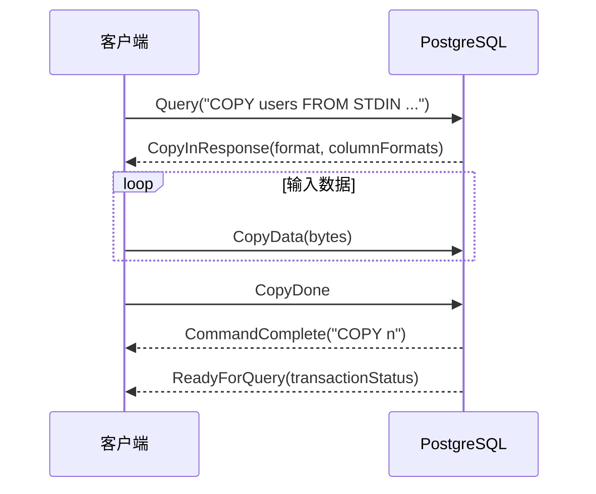
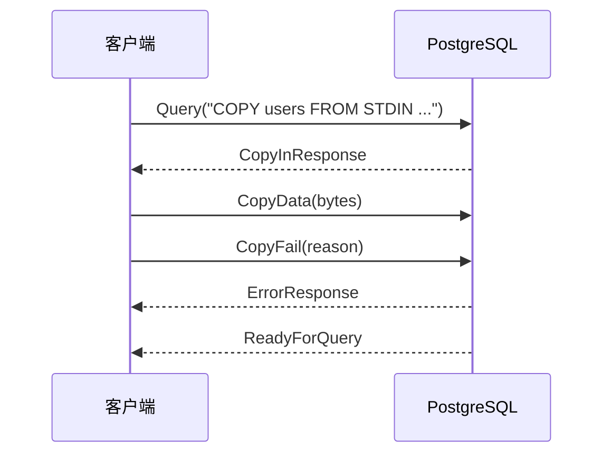
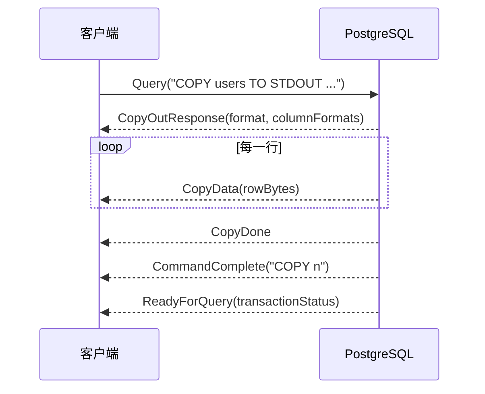
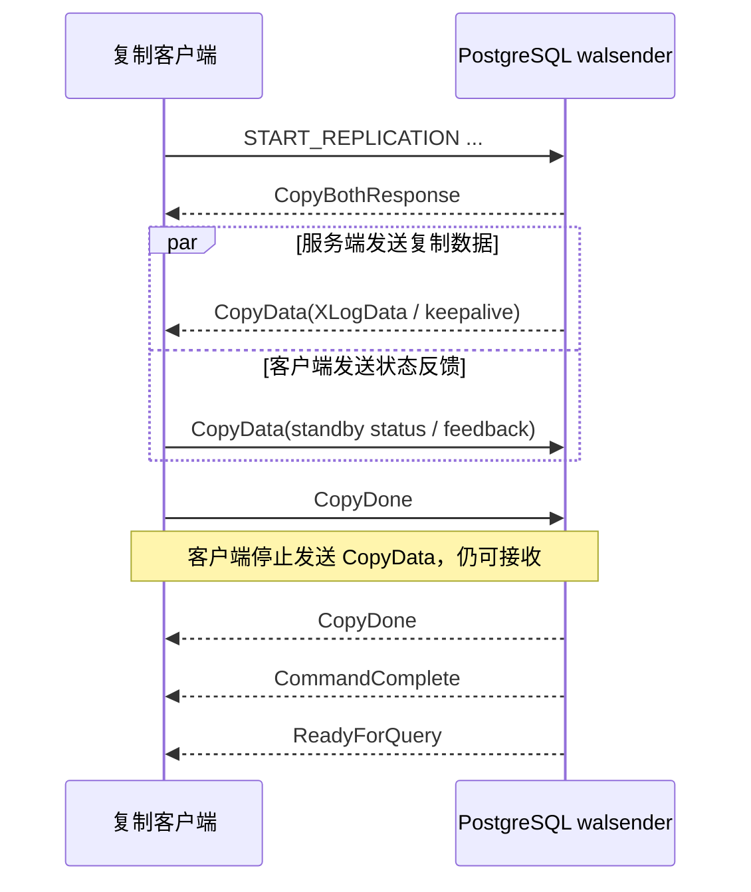
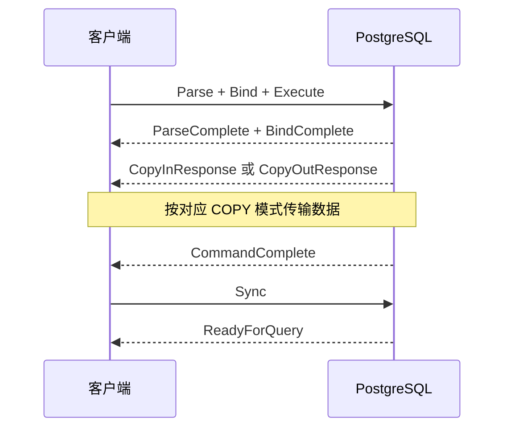

# PostgreSQL COPY 协议

PostgreSQL 的 `COPY` 命令用于在客户端和服务端之间高速传输大量数据。当服务端执行
`COPY ... FROM STDIN`、`COPY ... TO STDOUT` 或复制命令时，连接会暂时进入独立的 COPY
子协议；传输结束后，连接再回到此前的简单查询或扩展查询协议。

## COPY 模式

| 模式      | 启动响应           | 数据方向       | 常见用途                         |
| --------- | ------------------ | -------------- | -------------------------------- |
| COPY IN   | `CopyInResponse`   | 客户端到服务端 | `COPY table FROM STDIN` 批量导入 |
| COPY OUT  | `CopyOutResponse`  | 服务端到客户端 | `COPY table TO STDOUT` 批量导出  |
| COPY BOTH | `CopyBothResponse` | 双向           | 物理或逻辑流复制                 |

COPY 命令可以通过简单查询的 `Query` 消息启动，也可以通过扩展查询的 `Parse`、`Bind` 和 `Execute` 启动。收到 COPY
响应后，后续消息的合法性由当前 COPY 模式决定。

## 响应格式

`CopyInResponse`、`CopyOutResponse` 和 `CopyBothResponse` 都包含：

- 整体格式：`0` 表示文本，`1` 表示二进制。
- 列数量。
- 每列格式：`0` 表示文本，`1` 表示二进制。

文本格式的分隔符、转义、`NULL` 表示和 CSV 规则由 SQL 中的 `COPY` 选项决定。二进制 COPY 使用 PostgreSQL
专用的二进制文件格式，并不等同于普通查询的二进制 `DataRow`。

## COPY FROM STDIN

`COPY FROM STDIN` 把客户端数据导入服务端。服务端发送 `CopyInResponse` 后，客户端发送 零个或多个 `CopyData`，最后使用
`CopyDone` 表示输入完成，或使用 `CopyFail` 主动终止。

### 正常流程



客户端发送的 `CopyData` 是连续输入流的任意分片，不要求一个消息对应一行。实现时不应假设 换行符、CSV
字段或二进制元组一定完整地位于单个消息中。

### 客户端主动失败

客户端无法继续提供数据时，应发送带原因文本的 `CopyFail`，而不是直接停止写入：



如果 COPY 由扩展查询启动，错误发生后服务端会丢弃普通前端消息直到收到 `Sync`，随后发送 `ReadyForQuery`。如果 COPY
由简单查询启动，服务端会放弃该 `Query` 中剩余的 SQL，并直接 发送 `ReadyForQuery`。

COPY IN 期间服务端会忽略 `Flush` 和 `Sync`。其他非 COPY 消息属于协议错误，并会终止 COPY。因此扩展查询客户端必须在 COPY
结束后确保存在有效的 `Sync`，再等待 `ReadyForQuery`。

## COPY TO STDOUT

`COPY TO STDOUT` 把服务端数据导出到客户端。服务端发送 `CopyOutResponse`，接着发送零个 或多个 `CopyData`，再以 `CopyDone`
结束数据流。



服务端发送的每个 `CopyData` 对应一行，但一行内部仍可能包含任意字节，不能按网络读取边界 解析。文本或 CSV 数据还应按照
COPY 格式规则解析，而不是简单地按逗号切分。

客户端不能在当前连接上使用 `CopyFail` 中止 COPY OUT。若不再需要数据，可以：

- 继续读取并丢弃所有 `CopyData`，直到 `CopyDone`、`CommandComplete` 和 `ReadyForQuery`。
- 通过新连接发送 `CancelRequest`，然后在原连接上继续读取到终止响应。
- 关闭连接；此时该连接不能再复用。

## COPY BOTH

COPY BOTH 主要用于流复制。服务端发送 `CopyBothResponse` 后，双方都可以发送 `CopyData`：



一方发送 `CopyDone` 后，该方向立即关闭：

- 客户端发送 `CopyDone` 后不能再发送 `CopyData`，但仍可以接收服务端数据。
- 服务端发送 `CopyDone` 后不会再发送 `CopyData`，但仍可以接收客户端数据。
- 双方都发送 `CopyDone` 后，COPY BOTH 才结束。

`CopyData` 在复制模式中只是外层载体，其内部还包含 `XLogData`、主库 keepalive、standby status update 等复制子协议消息。

## 简单查询与扩展查询

简单查询启动 COPY 时，正常结束序列为：

```text
CopyDone -> CommandComplete -> ReadyForQuery
```

扩展查询启动 COPY 时，COPY 完成后回到扩展查询模式。客户端需要用 `Sync` 建立恢复边界：



若客户端在 `Execute` 后提前发送了 `Sync`，服务端在 COPY IN 模式中读取到它时会将其忽略。 客户端仍需在 COPY 完成后发送新的
`Sync`。

## 错误与异步消息

- 服务端可在 COPY 期间发送 `ErrorResponse`；收到后应视为 COPY 已终止。
- `NoticeResponse`、`ParameterStatus` 等异步消息可能穿插在 `CopyData` 之间，不能把它们 当作数据流结束。
- 扩展查询发生错误后，应继续恢复到与 `Sync` 对应的 `ReadyForQuery`，再复用连接。
- 简单查询发生错误后，应读取到 `ReadyForQuery`。
- 网络中断或无法识别的协议消息会破坏连接状态，此时应关闭连接。

## 流式 API 实现要求

- 写入 COPY IN 时，应让 `WritableStream` 的背压传播到底层套接字，不能无限缓存 `CopyData`。
- 正常关闭写入流时发送 `CopyDone`；写入流异常时发送 `CopyFail`，并排空后续协议响应。
- 读取 COPY OUT 时，应让 `ReadableStream` 的消费速度约束套接字读取和内存占用。
- 取消读取 COPY OUT 不能只停止消费；实现必须选择排空、发送 `CancelRequest` 或销毁连接。
- COPY 数据应保持为 `Uint8Array`。文本解码、CSV 解析和二进制 COPY 解析属于上层能力。
- `CommandComplete` 的标签形如 `COPY n`，其中 `n` 是服务端报告的复制行数。
