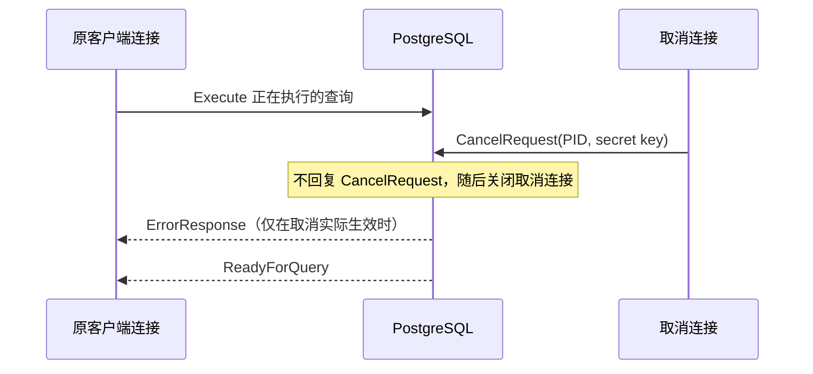

# PostgreSQL 异步消息与取消请求

本文整理 PostgreSQL
前后端协议中的异步消息和取消正在执行的请求。它们都要求客户端以状态机方式处理连接：不能将某一种消息误认为唯一可能的下一条消息，也不能在响应尚未排空时复用连接。

本文基于 [PostgreSQL 18 Message Flow](https://www.postgresql.org/docs/18/protocol-flow.html) 的 Asynchronous Operations
和 Canceling Requests in Progress 两节。

## 异步消息

后端可以在没有对应前端命令的情况下发送消息。客户端即使在连接空闲、尚未开始读取某个查询响应时，也必须处理它们；至少应在开始读取查询响应前检查这类消息。

### NoticeResponse

`NoticeResponse`
可能由外部事件触发。例如管理员执行快速关闭时，后端可能先发送通知，再关闭连接。客户端应随时接收并按应用策略记录、回调或展示通知，不能仅在某条
SQL 的固定响应位置读取它。

### ParameterStatus

`ParameterStatus` 表示客户端应知晓的会话参数当前值。它常由客户端执行 `SET` 触发，但也可能来自管理员修改配置并发送
`SIGHUP`，或来自事务回滚后参数值恢复。

客户端应维护自己关心的参数值，并忽略未知或不关心的参数。服务器报告的参数集合可能在 PostgreSQL 版本间变化；例如
PostgreSQL 18 会报告 `search_path`。`server_version`、`server_encoding` 和 `integer_datetimes`
是启动后不会变化的伪参数。

### NotificationResponse

在执行 `LISTEN` 后，只要其他会话对相同通道执行 `NOTIFY`，后端就会发送
`NotificationResponse`。当前实现通常只会在事务外发送它，可能紧邻
`ReadyForQuery`；但客户端不应把这一现状当作协议保证，应能在任何合规位置处理通知。

### 实现建议

- 在所有响应读取循环中，将 `NoticeResponse`、`ParameterStatus` 和 `NotificationResponse` 作为独立分支处理。
- 不要把异步消息计入某个查询的行数、命令完成数或 `Sync` 完成数。
- 后端通知连接关闭或读取到 EOF 时，标记连接不可复用，并让所有等待该连接的操作失败或取消。

## 取消正在执行的请求

取消请求不通过正在执行 SQL 的普通连接发送。客户端应保存启动阶段 `BackendKeyData` 提供的 PID 和 secret
key，并在需要取消时另开一个到同一服务器的连接：

取消连接发送 `CancelRequest`，而非通常的 `StartupMessage`。服务器处理后关闭这条取消连接，且不会对取消请求返回直接响应。

服务器只有在 PID 和 secret key
与当前正在执行的后端匹配时才会尝试中止当前命令。取消是竞态操作：如果请求到达时命令已经完成，它不会产生效果；即使请求匹配，也没有单独的成功确认。客户端必须继续等待原连接的协议响应，才能知道查询最终成功还是以错误结束。

### 取消后的连接处理

- 发送取消请求不表示原连接已经空闲，不能立即归还连接池。
- 原连接仍需持续读取到该命令所属同步边界：简单查询读取到 `ReadyForQuery`；扩展查询读取到对应 `Sync` 的 `ReadyForQuery`。
- 取消有效时，当前命令通常以 `ErrorResponse` 结束；扩展查询随后会丢弃消息直到 `Sync`。
- 取消连接可能使用 SSL 或 GSSAPI 加密协商；它与普通启动连接一样需要遵循服务器的传输安全要求。

由于取消请求使用 PID 加动态 secret
key，拥有该信息的其他进程也可以代表客户端发送取消。这有利于多进程应用协调超时，但应避免泄露 `BackendKeyData`。

## 状态机检查表

- 在任何读取状态下优先处理 `ErrorResponse`、`NoticeResponse`、`ParameterStatus` 和 `NotificationResponse`。
- 取消操作仅负责发起请求；查询任务的完成、失败和连接释放仍由原连接的响应流决定。
- 遇到协议无法识别的消息、无法恢复的解析错误或意外 EOF 时，关闭连接而不是尝试继续复用。
- 连接池只接收已排空响应、且处于可用事务状态的连接。
