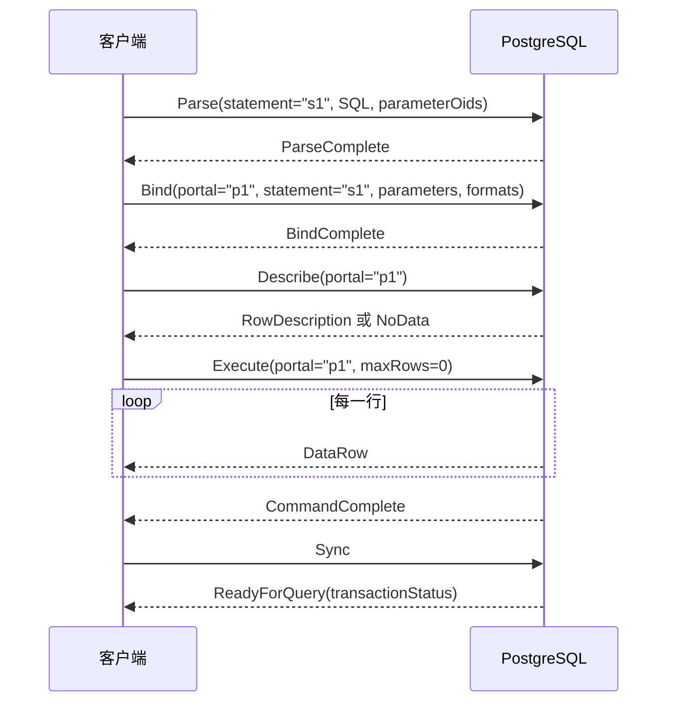
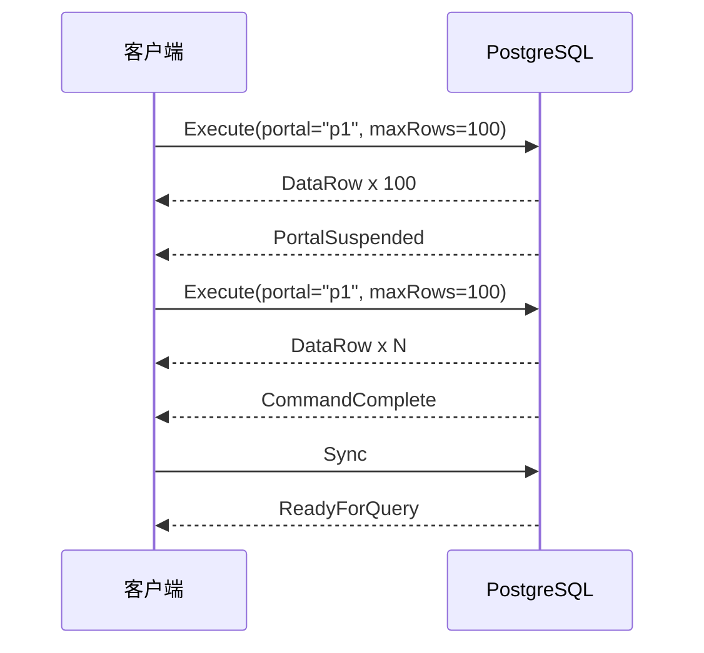
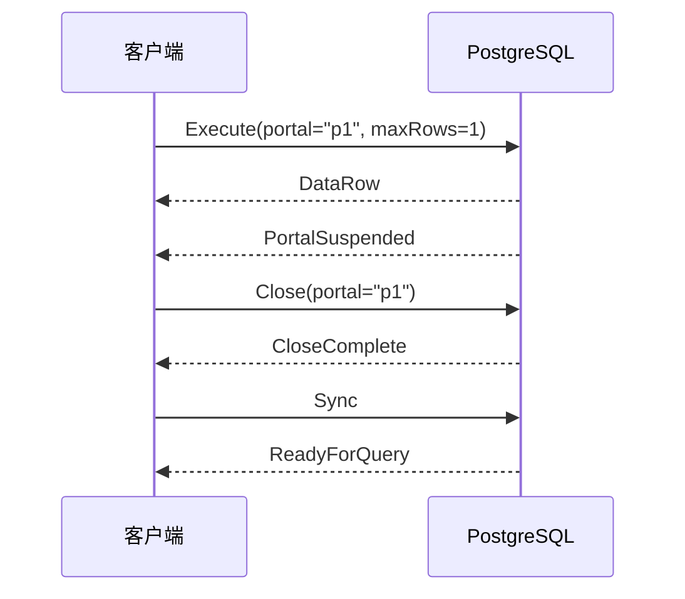
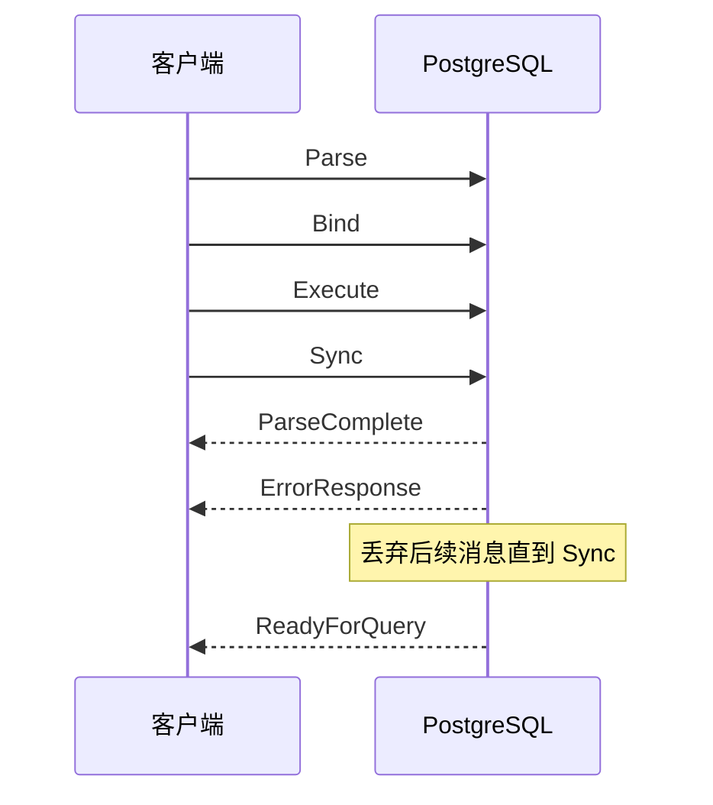

# PostgreSQL 扩展查询协议

扩展查询协议（Extended Query
Protocol）把一次查询拆分为多个前端消息，使客户端能够安全地传递参数、复用预备语句、选择文本或二进制格式，并通过 Portal
分批读取结果。

核心消息序列通常是：

```text
Parse -> Bind -> Describe（可选）-> Execute -> Sync
```

## 核心对象

- **Prepared Statement**：`Parse` 创建的已解析语句。它保存 SQL 和参数类型，但查询计划通常到 `Bind` 时才生成。
- **Portal**：`Bind` 创建的执行上下文，包含具体参数和结果格式。`Execute` 操作的是 Portal，而不是 Prepared Statement。
- **命名对象**：命名 Prepared Statement 通常持续到会话结束或显式 `Close`；命名 Portal 通常持续到事务结束或显式 `Close`。
- **匿名对象**：名称为空字符串。下一次创建同类匿名对象时会替换旧对象，事务结束或简单查询也可能销毁它们。

## 完整流程



客户端可以把 `Parse`、`Bind`、`Describe`、`Execute` 和 `Sync`
连续写入网络，而不必等待每一步响应。服务端仍按顺序处理并返回消息，这能减少网络往返。

## 各阶段语义

### Parse

`Parse` 包含 Prepared Statement 名称、单条 SQL 和可选的参数类型 OID。一个 `Parse` 中不能包含多条 SQL。

参数类型可以：

- 显式指定 OID。
- 使用 `0` 表示未指定。
- 少于 SQL 中的参数数量，让服务端推断剩余类型。

成功响应为 `ParseComplete`，失败响应为 `ErrorResponse`。

### Bind

`Bind` 把参数绑定到 Prepared Statement，并创建 Portal。消息同时指定：

- 每个参数采用文本还是二进制格式。
- 参数原始字节，`-1` 长度表示 SQL `NULL`。
- 查询结果采用文本还是二进制格式。

查询规划通常发生在这个阶段。成功响应为 `BindComplete`。

### Describe

`Describe` 是可选步骤，可以描述两种对象：

- 描述 Prepared Statement：先返回 `ParameterDescription`，再返回 `RowDescription` 或 `NoData`。
- 描述 Portal：返回 `RowDescription` 或 `NoData`。

若客户端已经知道结果列布局，可以省略 `Describe`。注意 `Execute` 本身不会返回 `RowDescription`。

### Execute

`Execute` 执行指定 Portal。`maxRows` 的含义：

- `0`：执行到完成，返回全部结果。
- 大于 `0`：最多返回指定行数。

一次 Execute 阶段由以下消息之一结束：

- `CommandComplete`：命令执行完成。
- `PortalSuspended`：已达到 `maxRows`，Portal 尚未执行完。
- `EmptyQueryResponse`：Portal 来自空查询。
- `ErrorResponse`：执行失败。

### Sync

`Sync` 建立扩展查询协议的同步点。服务端处理到它后返回 `ReadyForQuery`，其中包含当前事务状态：空闲、事务中或失败事务中。

若当前不在显式事务中，`Sync` 会结束隐式事务：前面的操作成功则提交，失败则回滚。它不会提交由 `BEGIN` 打开的显式事务。

## 分批读取

当 `maxRows` 大于 `0` 时，可以对同一个 Portal 重复发送 `Execute`：



`PortalSuspended` 表示还可以继续执行；只有收到 `CommandComplete` 才表示源 SQL 已执行完成。

### 只读取一行并放弃剩余结果

假设查询能够返回一万行，但客户端只想读取第一行，可以把 `Execute` 的 `maxRows` 设为 `1`。服务端返回一条 `DataRow` 和
`PortalSuspended` 后，客户端发送 `Close` 关闭 Portal，再发送 `Sync`，并持续读取到 `ReadyForQuery`：



不能在读取第一条 `DataRow` 后直接停止读取，否则连接中仍有当前命令的响应消息，连接无法安全复用。客户端必须读取到
`PortalSuspended`，并完成 `Close` 和 `Sync` 对应的响应。

这种方式可以避免将剩余行全部传输给客户端，但数据库可能仍需完成部分扫描、排序或连接操作。如果业务语义本来就是“最多一行”，应优先在
SQL 中使用 `LIMIT 1`，让优化器有机会减少数据库端的工作量。

## 错误恢复

扩展查询序列中任一消息处理失败时，服务端发送 `ErrorResponse`，随后丢弃普通前端消息，直到读取到 `Sync`：



因此客户端遇到 `ErrorResponse` 后不能立即复用连接，必须继续读取到与 `Sync` 对应的
`ReadyForQuery`。流水线发送多个同步段时，应按发送的 `Sync` 数量统计 `ReadyForQuery`，不能仅依赖 `CommandComplete`。

## 与简单查询的区别

| 能力          | 简单查询          | 扩展查询                          |
| ------------- | ----------------- | --------------------------------- |
| 前端入口      | 单个 `Query` 消息 | `Parse`、`Bind`、`Execute` 等消息 |
| 单次 SQL 数量 | 可以包含多条 SQL  | 每个 `Parse` 只能包含一条 SQL     |
| 参数          | 需要拼入 SQL 文本 | 参数与 SQL 分离传输               |
| 数据格式      | 通常为文本        | 参数和结果均可选择文本或二进制    |
| 分批读取      | 不直接支持        | 通过 Portal 和 `maxRows` 支持     |
| 预备语句复用  | 不支持            | 支持命名 Prepared Statement       |

参数化能避免把参数内容解释成 SQL 语法，但表名、列名和排序方向等标识符不能作为普通参数绑定，仍需安全地生成或引用。

## 示例

查询目标：

```sql
SELECT * FROM users WHERE id = $1
```

对应消息：

```text
Parse(statement="s1", sql="SELECT * FROM users WHERE id = $1", parameterOids=[INT4_OID])
Bind(portal="p1", statement="s1", parameters=[123], resultFormats=[text])
Describe(target=portal, name="p1")
Execute(portal="p1", maxRows=0)
Sync()
```

这与 SQL 层的 `PREPARE`、`EXECUTE`、`DEALLOCATE` 概念相近，但并不完全等价：协议对象直接属于当前会话，并由
`Parse`、`Bind` 和 `Close` 消息管理。

## 实现要点

- 使用状态机处理响应，不要假设每一步只会收到一种消息。
- 在任意阶段都准备处理 `ErrorResponse`、`NoticeResponse`、`ParameterStatus` 和通知消息。
- 复用命名 Prepared Statement 时，确保 SQL、名称和参数类型定义一致。
- 不再使用的命名 Prepared Statement 或 Portal 应发送 `Close`，并等待 `CloseComplete`。
- 如果需要在发送 `Sync` 前读取中间响应，应发送 `Flush`，要求服务端刷新输出缓冲区。
