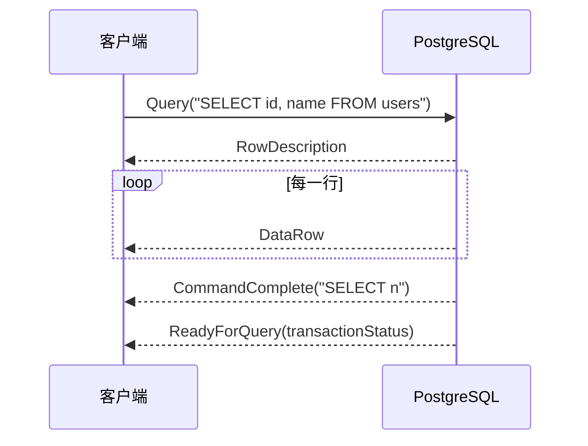
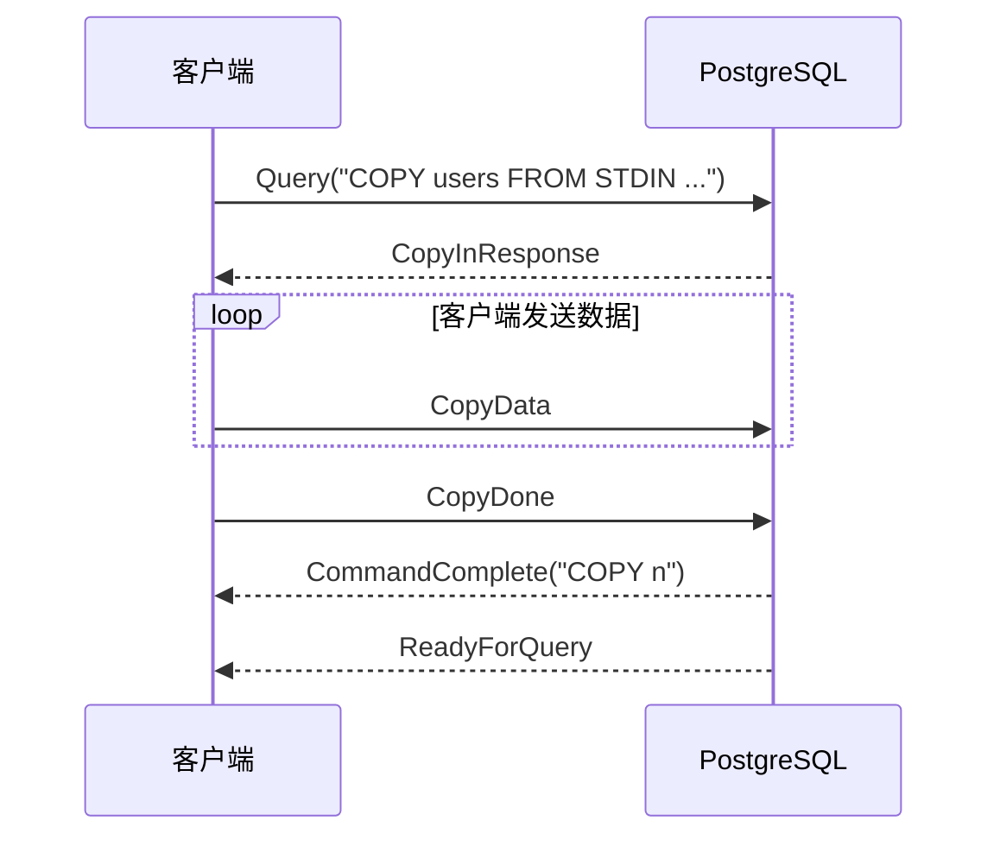

# PostgreSQL 简单查询协议

简单查询协议（Simple Query Protocol）通过一个 `Query` 消息发送完整的 SQL 文本。服务端 解析并执行
SQL，然后返回一个或多个结果消息，最后发送 `ReadyForQuery`，表示连接可以 开始下一轮查询。

简单查询适合直接执行不需要单独绑定参数的 SQL。需要参数化、预备语句、二进制结果或 分批读取时，应使用扩展查询协议。

## 基本流程



客户端发送的 `Query` 只有一个 SQL 字符串字段。服务端通常按以下顺序返回查询结果：

```text
RowDescription -> DataRow（零个或多个）-> CommandComplete -> ReadyForQuery
```

不返回行的命令（例如 `INSERT`、`UPDATE`、`DELETE`）通常只返回：

```text
CommandComplete -> ReadyForQuery
```

`CommandComplete` 的标签包含命令类型和影响行数，例如 `INSERT 0 1`、`UPDATE 3` 或 `SELECT 10`。`ReadyForQuery`
还包含事务状态：`I` 表示空闲，`T` 表示事务中，`E` 表示当前处于失败事务块中。

## 多条 SQL

一个 `Query` 消息可以包含以分号分隔的多条 SQL。服务端会依次处理每条语句，并为每条 语句发送自己的结果序列，但整个 `Query`
消息只在全部处理结束后发送一个 `ReadyForQuery`：

```mermaid
sequenceDiagram
  participant C as 客户端
  participant S as PostgreSQL

  C->>S: Query("INSERT ...; SELECT ...;")
  S-->>C: CommandComplete("INSERT 0 1")
  S-->>C: RowDescription
  S-->>C: DataRow x N
  S-->>C: CommandComplete("SELECT N")
  S-->>C: ReadyForQuery
```

多条 SQL 在没有显式事务控制时通常作为一个隐式事务块执行：全部成功则提交，发生错误
则回滚尚未提交的操作，并停止处理后续语句。若包含 `BEGIN`、`COMMIT` 或 `ROLLBACK`， 则由这些显式命令改变事务边界。

客户端不能只等待某一条语句的 `CommandComplete` 就认为整个请求完成，必须读取到 `ReadyForQuery`。

## 结果格式

简单查询返回的字段值通常使用文本格式。对于返回行的查询，客户端应先处理 `RowDescription`，根据字段数量、名称、类型
OID、类型修饰符和格式解析后续的每个 `DataRow`。

`DataRow` 的每个字段都带有长度：

- `-1` 表示 SQL `NULL`。
- `0` 表示长度为零的值。
- 大于 `0` 表示后续有对应长度的字段字节。

简单查询不会像扩展查询的 `Bind` 那样选择每个结果列的文本或二进制格式。若应用需要
明确控制参数和结果格式，应使用扩展查询协议。

## 空查询

当 SQL 字符串为空或只包含空白字符时，服务端返回：

```text
EmptyQueryResponse -> ReadyForQuery
```

此时不会发送 `CommandComplete`。

## 错误处理

如果执行 SQL 时发生错误，服务端发送 `ErrorResponse`，停止处理当前 `Query` 中剩余的 SQL，然后发送 `ReadyForQuery`：

```mermaid
sequenceDiagram
  participant C as 客户端
  participant S as PostgreSQL

  C->>S: Query("INSERT ...; SELECT invalid;")
  S-->>C: CommandComplete("INSERT 0 1")
  S-->>C: ErrorResponse
  Note over S: 放弃当前 Query 中剩余的 SQL
  S-->>C: ReadyForQuery(transactionStatus)
```

收到 `ErrorResponse` 后，客户端仍必须继续读取到 `ReadyForQuery`，才能安全复用连接。 如果 `ReadyForQuery` 的事务状态是
`E`，说明显式事务已经失败，后续 SQL 会被拒绝，必须 发送 `ROLLBACK` 或使用保存点恢复。

`NoticeResponse`、`ParameterStatus` 和 `NotificationResponse` 等异步消息可能出现在
响应序列中。客户端应将它们作为独立消息处理，不能把它们误判为当前查询完成。

## COPY

简单查询执行 `COPY ... FROM STDIN` 或 `COPY ... TO STDOUT` 时，会从普通查询响应切换到 COPY 子协议：



`COPY TO STDOUT` 则由服务端发送 `CopyOutResponse`、多个 `CopyData` 和 `CopyDone`，最后 发送 `CommandComplete` 与
`ReadyForQuery`。COPY 的详细消息流程见 [COPY协议.md](COPY协议.md)。

## 查询与连接生命周期

- `Query` 消息完成后，必须读取到 `ReadyForQuery`，才能把连接交还连接池。
- 如果应用不需要结果行，也不能直接停止读取；应继续读取并丢弃 `DataRow`，直到 `CommandComplete` 和 `ReadyForQuery`。
- 如果只需要少量结果，简单查询本身没有 `maxRows` 参数。优先在 SQL 中使用 `LIMIT`，否则服务端仍会生成并发送全部结果。
- 取消正在执行的查询应使用单独连接发送 `CancelRequest`，原连接仍需继续读取最终响应。
- 客户端发送 `Terminate` 后连接结束，未提交事务会回滚；该连接不能再次使用。

## 与扩展查询的区别

| 能力     | 简单查询                       | 扩展查询                                   |
| -------- | ------------------------------ | ------------------------------------------ |
| 前端消息 | 一个 `Query`                   | `Parse`、`Bind`、`Execute` 等              |
| SQL 数量 | 一个消息可包含多条 SQL         | 一个 `Parse` 只能包含一条 SQL              |
| 参数     | 需要自行安全地生成 SQL 文本    | 参数与 SQL 分离传输                        |
| 结果格式 | 通常为文本                     | 可在 `Bind` 中选择文本或二进制             |
| 分批读取 | 不支持协议级 `maxRows`         | Portal 支持 `maxRows` 和 `PortalSuspended` |
| 预备语句 | 不直接支持                     | 支持 Prepared Statement                    |
| 同步边界 | 服务端直接发送 `ReadyForQuery` | 客户端使用 `Sync` 建立同步点               |

## 客户端实现建议

- 使用状态机解析响应，不要假设每次 `Query` 只会返回一种结果。
- 为每条返回行预先处理 `RowDescription`，并按协议长度读取字段，避免把 `NULL` 当成空字节。
- 始终处理 `ErrorResponse`、`NoticeResponse`、`ParameterStatus` 和通知消息。
- 连接池归还连接前，必须确认已经收到 `ReadyForQuery`，且没有未消费的响应数据。
- 对不可信输入不要直接拼接 SQL；简单查询没有参数绑定能力，参数化场景使用扩展查询。
