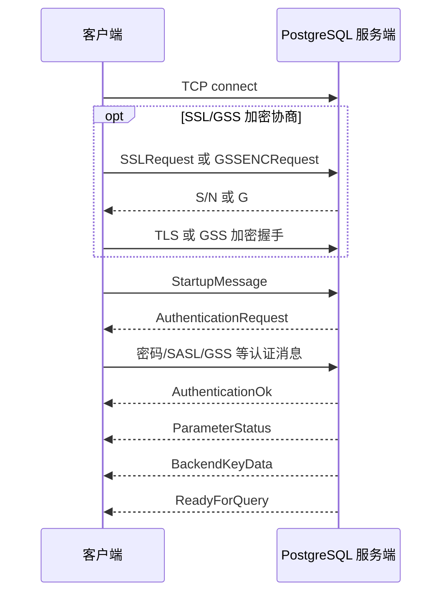

本文按“连接建立、可选加密、启动参数、认证交换、进入可用状态”的时间线说明协议。原生 API 支持 trust、cleartext password 和
SCRAM-SHA-256；MD5、GSSAPI/SSPI 与复制 模式不在当前实现范围。

核心结论：认证成功的协议标志是服务端发送 `AuthenticationOk`，但连接真正可执行 SQL 通常还要等到服务端继续发送
`ParameterStatus`、`BackendKeyData` 和最终的 `ReadyForQuery`。`trust`、`peer`、`cert`
等是服务器选择的认证策略，只有其中一部分会在 PostgreSQL wire protocol 中表现为密码或 SASL/GSS 交换。

**PostgreSQL 使用的是基于消息的前后端协议。**客户端称为 Frontend，服务端称为 Backend。以 PostgreSQL 协议 3.0 为例，从
TCP 连接建立到认证完成，大致经过以下阶段：



## 1. TCP 连接

客户端首先连接 PostgreSQL 的 TCP 端口，默认是：

```text
127.0.0.1:5432
```

这一步只建立网络连接，还没有说明：

- 使用哪个数据库
- 用户名是什么
- 客户端支持什么协议
- 是否需要密码
- 是否使用 TLS

如果服务端端口无法访问，客户端会直接收到类似：

```text
ECONNREFUSED 127.0.0.1:5432
```

这类错误发生在 PostgreSQL 协议开始之前。

## 2. 可选的 SSL 或 GSS 加密协商

PostgreSQL 客户端通常可以先询问服务端是否支持加密。

### SSLRequest

客户端发送一个特殊的 8 字节请求：

```text
长度: 8
代码: 80877103
```

服务端返回单字节：

```text
S
```

表示支持 SSL，或者：

```text
N
```

表示不支持。

如果返回 `S`，双方接着执行 TLS 握手。TLS 握手成功后，后续 PostgreSQL 协议消息都在 TLS 连接中传输。

注意，`SSLRequest` 本身还不是 PostgreSQL 的普通协议消息，它没有消息类型字节。

### GSSENCRequest

客户端也可以询问服务端是否支持 GSSAPI 加密：

```text
长度: 8
代码: 80877104
```

服务端可能返回：

```text
G
```

表示支持 GSS 加密，或者：

```text
N
```

表示不支持。

GSS 加密常见于 Kerberos 环境。它和后面用于身份认证的 GSSAPI 不是完全一回事：

- GSS 加密：保护连接内容
- GSSAPI 认证：证明客户端身份

实际使用中通常优先使用 TLS，除非部署环境已经以 Kerberos/GSS 为中心。

## 3. StartupMessage

加密协商完成后，客户端发送启动消息。启动消息包含协议版本和键值参数，例如：

```text
user\0alice\0
database\0app_db\0
application_name\0my_app\0
client_encoding\0UTF8\0
\0
```

协议版本 3.0 的版本号是：

```text
196608
```

StartupMessage 的结构大致是：

```text
Int32 length
Int32 protocol version
String parameter name
String parameter value
...
Int8 0
```

与普通 PostgreSQL 消息不同，StartupMessage 没有单独的消息类型字节。

常见启动参数包括：

- `user`：数据库用户
- `database`：目标数据库
- `application_name`：客户端名称
- `client_encoding`：客户端编码
- `options`：服务器启动选项
- `replication`：是否请求复制模式

服务端会根据以下信息决定使用哪条 `pg_hba.conf` 规则：

- 连接类型：本地 Unix Socket、TCP、复制连接等
- 客户端地址
- 目标数据库
- 用户名
- SSL 是否已启用

## 4. 服务端选择认证方式

服务端根据 `pg_hba.conf` 选中认证规则后，可能有几种结果。

### 直接允许

例如：

```text
local all all trust
```

服务端不需要客户端提供任何秘密信息，通常直接发送：

```text
AuthenticationOk
```

### 要求客户端认证

服务端发送：

```text
AuthenticationRequest
```

该消息包含一个认证类型代码。不同代码表示不同的认证方法，例如：

| 类型               | 协议代码 | 含义                    |
| ------------------ | -------: | ----------------------- |
| `AuthenticationOk` |        0 | 认证成功                |
| Cleartext Password |        3 | 明文密码                |
| MD5 Password       |        5 | MD5 挑战响应            |
| SASL               |       10 | SASL 认证，通常是 SCRAM |
| SASL Continue      |       11 | 服务端继续 SASL 交换    |
| SASL Final         |       12 | 服务端完成 SASL 交换    |
| GSS                |        7 | GSSAPI/Kerberos         |
| GSS Continue       |        8 | GSSAPI 继续交换         |
| SSPI               |        9 | Windows SSPI            |

认证过程中，服务端可能发送多个认证相关消息。

## 5. 认证成功后的初始化消息

客户端认证成功后，服务端通常还会发送：

### AuthenticationOk

这是“身份认证已经通过”的明确标志：

```text
'R'
length = 8
auth-code = 0
```

但此时连接还不一定已经完全准备好。

### ParameterStatus

服务端发送当前会话参数，例如：

```text
server_version = 16.3
server_encoding = UTF8
client_encoding = UTF8
DateStyle = ISO, MDY
TimeZone = Asia/Shanghai
standard_conforming_strings = on
```

客户端一般会缓存这些参数。

### BackendKeyData

服务端发送：

- Backend PID
- Secret key

这两个值用于取消查询。客户端之后可以通过另一条独立连接发送 CancelRequest：

```text
CancelRequest
```

取消请求不会复用原来的普通查询连接。

### ReadyForQuery

最后服务端发送：

```text
ReadyForQuery
```

其中包含当前事务状态：

| 字符 | 含义                 |
| ---- | -------------------- |
| `I`  | 空闲，可以执行新命令 |
| `T`  | 正在事务中           |
| `E`  | 事务已失败，需要回滚 |

因此，客户端判断连接真正进入可用状态，通常要等到：

```text
AuthenticationOk
...
ReadyForQuery
```

而不是仅仅看到 `AuthenticationOk`。

---

# 各种认证方式

这里要区分两个概念：

1. `pg_hba.conf` 中配置的认证策略
2. PostgreSQL wire protocol 中实际交换的消息

例如 `ldap`、`pam`、`radius` 都属于 `pg_hba.conf`
认证方法，但在线协议中经常仍表现为客户端发送密码，真正的验证动作由服务器端模块完成。

## 1. trust

配置示例：

```text
host app_db alice 10.0.0.0/8 trust
```

流程：

```text
客户端 -> StartupMessage
服务端 -> AuthenticationOk
服务端 -> ReadyForQuery
```

不会发送密码，也不会发送 SASL 消息。

优点：

- 配置简单
- 本地开发方便

风险：

- 只要能够匹配这条规则，就可以直接冒充对应用户
- 不适合暴露给不可信网络
- 即使数据库用户有密码，`trust` 也不会要求客户端提供密码

适合：

- 受严格保护的本地连接
- 测试环境
- 某些已经由外层系统完成认证的场景

## 2. reject

配置示例：

```text
host all all 0.0.0.0/0 reject
```

服务端直接返回：

```text
ErrorResponse
```

连接随后关闭，不会进入认证流程。

它通常用于明确拒绝某些网络、用户或数据库。

## 3. password，也就是明文密码认证

配置示例：

```text
host app_db all 10.0.0.0/8 password
```

服务端发送：

```text
AuthenticationCleartextPassword
```

客户端发送：

```text
PasswordMessage
```

消息体中包含以零字节结尾的密码。

流程是：

```text
S -> AuthenticationCleartextPassword
C -> PasswordMessage
S -> AuthenticationOk 或 ErrorResponse
```

这里的“明文”指的是 PostgreSQL 协议层没有对密码做哈希挑战响应，并不意味着密码一定以明文暴露在网络上：

- 如果外层使用 TLS，密码会被 TLS 保护
- 如果没有 TLS，监听网络的人可以获取密码

因此，`password` 通常只应与 SSL/TLS 一起使用。

## 4. md5

配置示例：

```text
host app_db all 10.0.0.0/8 md5
```

服务端发送一个 4 字节随机 salt：

```text
AuthenticationMD5Password
```

客户端计算：

$$
inner = MD5(password + username)
$$

然后计算：

$$
response = "md5" + MD5(inner + salt)
$$

最终发送的内容类似：

```text
md5f1c2...
```

流程是：

```text
S -> AuthenticationMD5Password(salt)
C -> PasswordMessage("md5...")
S -> AuthenticationOk 或 ErrorResponse
```

优点：

- 密码本身不直接通过 PostgreSQL 协议发送
- 比无 TLS 的明文密码更好

问题：

- MD5 已经不被认为是现代安全方案
- 存储格式和兼容性受到限制
- 不支持 SCRAM 的新特性
- 容易受到离线字典攻击
- 不能提供 SCRAM 的服务器证明和信道绑定

PostgreSQL 还有一个迁移行为：如果 `pg_hba.conf` 配置为：

```text
md5
```

但用户密码实际存储为 SCRAM verifier，较新的 PostgreSQL 服务器可能自动使用 SCRAM，而不是 MD5。因此，`md5`
规则不一定严格意味着线上一定是 MD5。

## 5. scram-sha-256

配置示例：

```text
host app_db all 10.0.0.0/8 scram-sha-256
```

这是目前 PostgreSQL 推荐的密码认证方式。

它基于：

- SASL
- SCRAM
- SHA-256
- PBKDF2
- 随机 nonce
- 客户端证明
- 服务端证明

### 用户密码的存储形式

服务器不保存原始密码，而保存 SCRAM verifier，类似：

```text
SCRAM-SHA-256$4096:salt$stored-key:server-key
```

其中包含：

- 哈希迭代次数
- salt
- StoredKey
- ServerKey

### 认证流程

服务器首先发送：

```text
AuthenticationSASL
```

其中列出支持的 SASL 机制，例如：

```text
SCRAM-SHA-256
SCRAM-SHA-256-PLUS
```

客户端发送 SASL 初始响应：

```text
SASLInitialResponse
```

内容包含：

- 用户名
- 客户端 nonce

服务端响应：

```text
AuthenticationSASLContinue
```

其中包含：

- 服务端 nonce
- salt
- 迭代次数

客户端计算 salted password 和 client proof，然后发送：

```text
SASLResponse
```

服务端验证 client proof，并返回：

```text
AuthenticationSASLFinal
```

其中包含 server signature。客户端验证 server signature 后，服务端发送：

```text
AuthenticationOk
```

完整流程可以简化为：

```text
S -> AuthenticationSASL
C -> SASLInitialResponse
S -> AuthenticationSASLContinue
C -> SASLResponse
S -> AuthenticationSASLFinal
S -> AuthenticationOk
```

### 为什么 SCRAM 更安全

SCRAM 相比 MD5 有几个重要优势：

- 服务端不需要保存明文密码
- 每次认证使用新的 nonce
- 使用 PBKDF2 增加暴力破解成本
- 客户端可以验证服务端确实知道密码
- 支持 channel binding
- 不直接传输密码
- 更适合现代密码存储和轮换策略

### `SCRAM-SHA-256-PLUS`

如果 TLS 和客户端库都支持 channel binding，可能使用：

```text
SCRAM-SHA-256-PLUS
```

它会把认证过程绑定到当前 TLS 信道，降低某些中间人攻击风险。

常见差异是：

- `SCRAM-SHA-256`：不使用 channel binding
- `SCRAM-SHA-256-PLUS`：使用 channel binding

客户端驱动需要正确选择机制，不能只看到 `PLUS` 就强制使用，因为服务端、TLS 库或客户端可能不支持相应的 binding 类型。

## 6. peer

`peer` 主要用于本地 Unix Socket 连接：

```text
local all all peer
```

服务端通过操作系统检查连接进程的 Unix 用户名，然后将它与 PostgreSQL 用户名比较。

例如：

```text
操作系统用户: alice
PostgreSQL 用户: alice
```

认证可以直接成功。

流程中通常不会出现密码或 SASL 消息：

```text
客户端 -> StartupMessage
服务端 -> AuthenticationOk
```

如果操作系统用户名和数据库用户名不同，可以使用用户映射：

```text
local all all peer map=my_map
```

然后在 `pg_ident.conf` 中配置映射关系。

特点：

- 只适用于本地连接
- 依赖操作系统身份
- 不适用于普通 TCP 远程连接
- 不需要数据库密码

## 7. ident

`ident` 通常用于 TCP 连接。服务端向客户端主机上的 Ident 服务询问：

> 发起这个 TCP 连接的操作系统用户是谁？

然后再将返回的用户名映射到 PostgreSQL 用户。

它依赖客户端机器运行 Ident 服务，因此现代环境中并不常见。由于信任边界和部署复杂度问题，通常不能把 ident
当作强密码认证替代品。

## 8. cert，也就是客户端证书认证

配置示例：

```text
hostssl app_db all 10.0.0.0/8 cert clientcert=verify-full
```

客户端在 TLS 握手阶段提供客户端证书。服务端验证：

- 证书链
- 证书有效期
- 证书用途
- 客户端证书是否由可信 CA 签发
- 证书中的身份是否匹配数据库用户

PostgreSQL 协议层可能不会再发送密码认证消息，而是直接发送：

```text
AuthenticationOk
```

身份映射可以通过 `pg_ident.conf` 完成，例如将证书的 Common Name 映射到数据库用户。

优点：

- 不需要传输密码
- 适合机器到机器认证
- 可由 CA 和证书生命周期管理身份

代价：

- 证书签发、分发、轮换和吊销管理更复杂
- 客户端必须正确配置证书和私钥
- 私钥保护非常重要

## 9. GSSAPI / Kerberos

配置示例：

```text
host app_db all 10.0.0.0/8 gss
```

客户端使用 Kerberos 凭据获取服务票据，然后与 PostgreSQL 服务端完成 GSSAPI 认证。

协议上常见：

```text
S -> AuthenticationGSS
C -> GSSResponse
S -> AuthenticationGSSContinue
C -> GSSResponse
...
S -> AuthenticationOk
```

实际交互次数由底层 GSSAPI/Kerberos token 决定。

特点：

- 适合企业域、统一身份认证和单点登录
- 客户端通常不需要直接发送数据库密码
- 依赖 Kerberos realm、服务主体、时钟同步和 DNS 配置
- 可以配置为仅认证，也可以用于 GSS 加密

相关配置通常包括：

- PostgreSQL 服务主体，例如 `postgres/server.example.com@REALM`
- 客户端 Kerberos ticket
- 服务端 keytab
- 用户映射

`gss` 和 `sspi` 都是基于 GSS 类机制，但 `sspi` 主要面向 Windows 集成认证。

## 10. SSPI

`sspi` 是 Windows 环境常用的集成认证机制。它可以使用 Windows 域身份进行认证，概念上类似 Kerberos/集成登录。

典型场景：

- Windows 客户端
- Active Directory
- 域内单点登录

协议上会出现：

```text
AuthenticationSSPI
```

以及若干 SSPI token 交换，最终以：

```text
AuthenticationOk
```

结束。

## 11. LDAP

配置示例：

```text
host app_db all 10.0.0.0/8 ldap
```

LDAP 认证一般由 PostgreSQL 服务器端连接 LDAP 服务验证用户名和密码。客户端与 PostgreSQL 之间通常仍是：

```text
S -> AuthenticationCleartextPassword
C -> PasswordMessage
S -> AuthenticationOk 或 ErrorResponse
```

也就是说：

- PostgreSQL 协议并没有单独的 `AuthenticationLDAP`
- LDAP 是服务器验证密码时使用的后端目录服务
- 如果没有 TLS，客户端到 PostgreSQL 的密码仍可能暴露
- 常见做法是使用 `hostssl` 或全局 SSL

## 12. PAM

PAM 也通常表现为密码认证：

```text
S -> AuthenticationCleartextPassword
C -> PasswordMessage
S -> AuthenticationOk 或 ErrorResponse
```

服务端通过操作系统 PAM 模块验证身份，可能接入：

- Linux 系统账户
- LDAP
- MFA
- 企业身份服务

PAM 的具体行为取决于操作系统和 PAM 配置。需要特别注意，某些复杂的 PAM 交互未必能通过普通 PostgreSQL
密码消息表达，因此部署时要确认客户端和认证模块的兼容性。

## 13. RADIUS

RADIUS 通常也由服务端接收 PostgreSQL 密码，然后向 RADIUS 服务器发起认证。

在线协议一般仍然类似：

```text
AuthenticationCleartextPassword
PasswordMessage
AuthenticationOk
```

安全性取决于：

- 客户端到 PostgreSQL 是否使用 TLS
- PostgreSQL 到 RADIUS 服务端之间的保护方式
- RADIUS 共享密钥配置
- RADIUS 服务本身的部署安全性

---

# 认证失败时发生什么

如果认证失败，服务端通常发送：

```text
ErrorResponse
```

消息中包含字段，例如：

```text
S: FATAL
C: 28P01
M: password authentication failed for user "alice"
```

常见 SQLSTATE：

| SQLSTATE | 含义         |
| -------- | ------------ |
| `28P01`  | 密码认证失败 |
| `28000`  | 无效授权规范 |
| `3D000`  | 数据库不存在 |
| `53300`  | 连接数过多   |

之后服务端一般会关闭连接。

客户端不能在同一个失败的启动流程中简单地“换一种认证方式继续尝试”，通常需要重新建立连接，并且服务端仍会根据 `pg_hba.conf`
选择认证策略。

# 一个完整的 SCRAM 示例

假设客户端使用：

```text
user = alice
database = app_db
password = secret
```

完整序列可以表示为：

```text
C -> TCP connect

C -> SSLRequest
S -> 'S'
C <-> TLS handshake

C -> StartupMessage
     user=alice
     database=app_db

S -> AuthenticationSASL
     SCRAM-SHA-256

C -> SASLInitialResponse
     n=alice,r=client_nonce

S -> AuthenticationSASLContinue
     r=server_nonce,s=salt,i=4096

C -> SASLResponse
     c=biws,r=server_nonce,p=client_proof

S -> AuthenticationSASLFinal
     v=server_signature

S -> AuthenticationOk
S -> ParameterStatus
S -> BackendKeyData
S -> ReadyForQuery('I')
```

到这里，连接才可以正常发送：

```text
Query("SELECT 1")
```

随后客户端会收到：

```text
RowDescription
DataRow
CommandComplete
ReadyForQuery
```

# 实际选择建议

一般可以按下面的优先级选择：

| 场景              | 建议                            |
| ----------------- | ------------------------------- |
| 本地开发          | `peer` 或受限范围内的 `trust`   |
| 普通 TCP 应用连接 | `scram-sha-256`                 |
| 旧客户端兼容      | 临时使用 `md5`，并尽快迁移      |
| 机器到机器        | TLS 客户端证书或 SCRAM          |
| 企业统一身份      | Kerberos/GSSAPI 或 SSPI         |
| 外部目录服务      | LDAP、PAM 或 RADIUS，并配合 TLS |
| 生产网络          | `hostssl`，避免无加密密码传输   |

最常见的现代生产配置是：

```text
hostssl app_db app_user 10.0.0.0/8 scram-sha-256
```

它同时表达了两层要求：

1. 必须使用 SSL/TLS
2. 必须使用 SCRAM-SHA-256 认证

最后要记住：**密码认证方式和传输加密是两个独立维度。**SCRAM 可以避免直接发送密码，但 TLS 仍然负责保护整个连接中的
SQL、结果集和其他会话数据。

已创建 2 个待办事项
